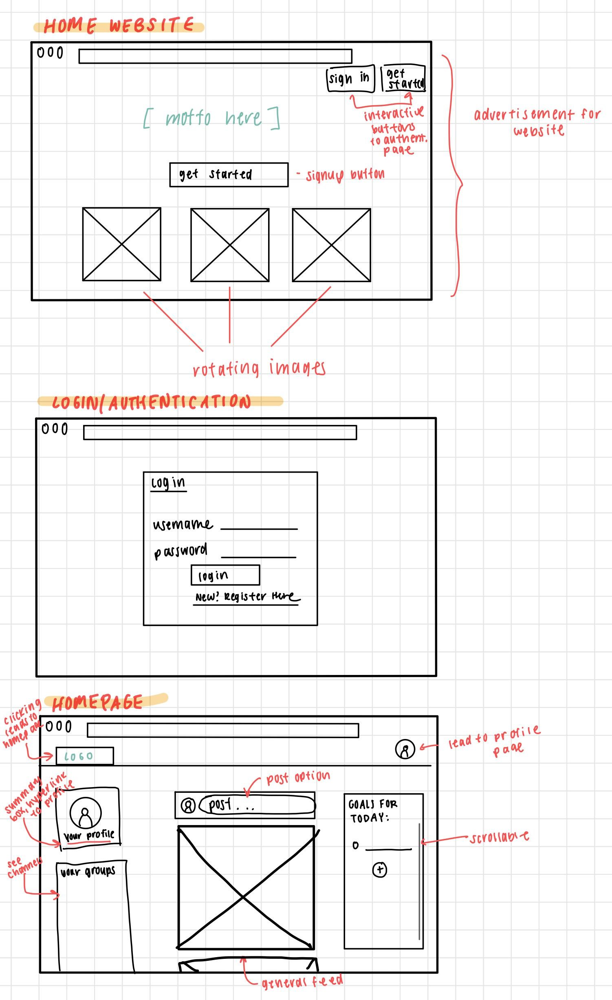
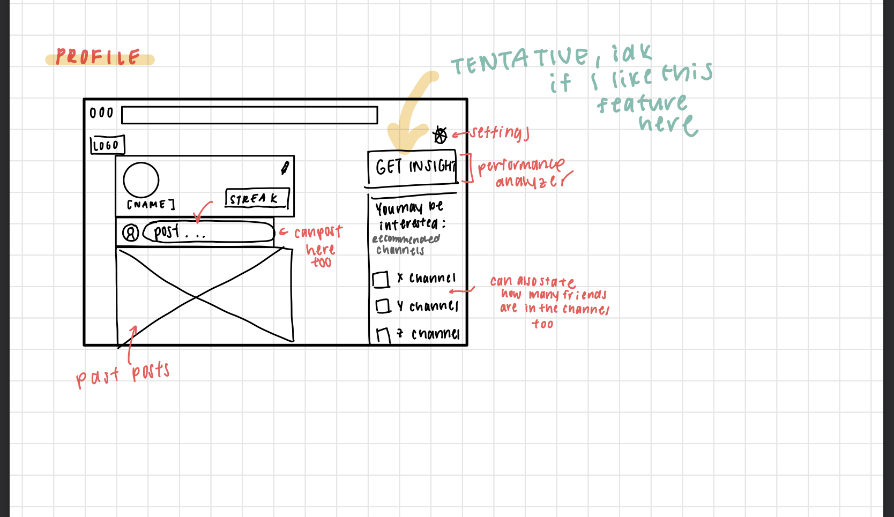
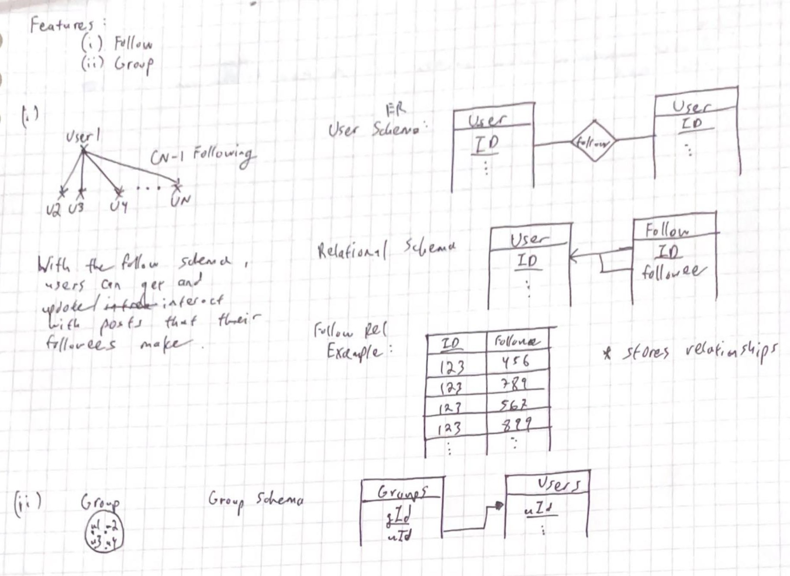
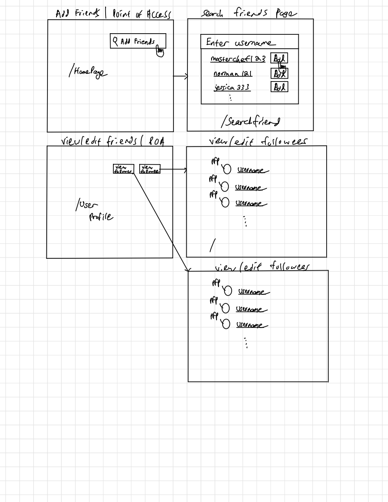
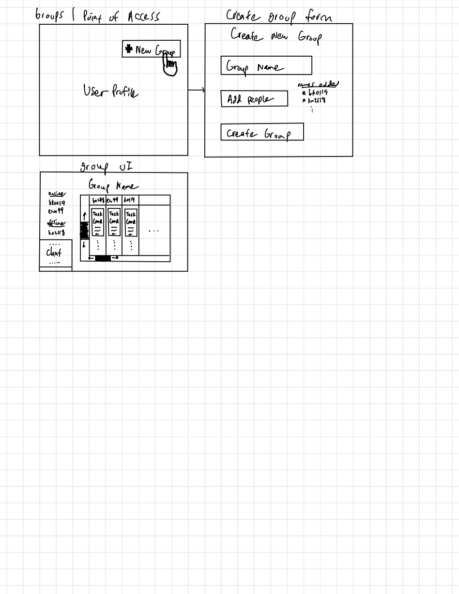
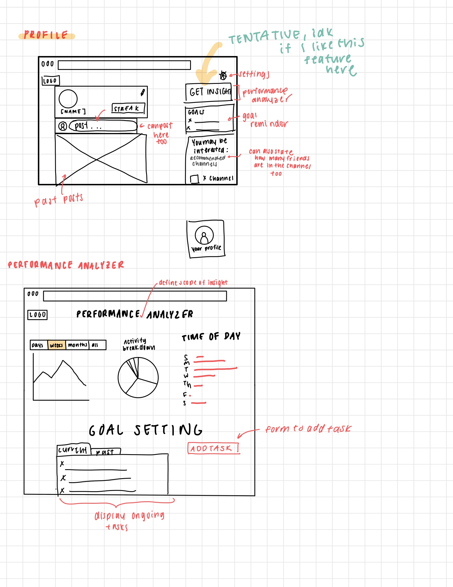

x Project Overview
## Team Members & Roles
| NAME | ROLE |
| --- | --- |
| Brian Kim | Full-Stack |
| Esther Wang | Back-End |
| Kaitlyn Chau | Front-End |
| Kevin Ng | Full-Stack |

## Tech Stack / Tools
- Front-end: React
- API server: flask and flask-restx
- OS: UNIX-like (MacOS, Linux, Windows Subsystem for Linux, etc.)
- Testing: pytest
- Database: MongoDB
- Build: make
- Lint: flake8
- CI/CD: GitHub Actions
- Cloud deployment: Heroku
- Project management: Notion & Kanban board on GitHub
- Design: Figma

# Potential Features
## Tasks
- Post Tasks
  - Tasks look like a blog which isn't simply like todos
  - Users can customize font size/weight/color
  - Can include lists (like bullet points) and tables
  - Can include an image
- Modify Task Attributes
  - Including update and delete

## Authentication
Authentication feature allows users to sign up for an account if they are a new user. If they are a returning user, they have the option to log in with their credientials, which will be used to autehnticate against our database for safe login.
- Returning User
  - Log in: User will provide username and password (encrypted) to authenicate against database
    - Required fields
    - Database: one to one relationship
    - password will be stored using SHA encryption salted
  - Log out: User will access 'Log Out' button, removing session ID to log out
- New User
  - Create Account Neccessary Credentials
    - First Name
    - Last Name
    - Date of Birth
    - Username 
    - Email Address 
    - Password
    - Reconfirm Password
  - New users will be checked against existing users database before proceeding to ensure there are no duplicates

## Post Feature
- Users can post to their walls with no restriction to text, img, video, audio, etc
- posts can be public or private based on setting

## Follow Feature 
- As a user, I want to follow other users to view and interact with followee's blogs.  
- As a user, I want to manage my followers to restrict who can view & interact w/ my blogs 
- As a user, I want to manage my followees to restrict whos blogs I want to view & interact
- As a user, I want to cancel my follow request to prevent follow mistakes. 
- As a user, I want search for users by username to view and follow others. 
- As a user, I want to see a follow button upon search to easily follow other users. 
- As a user, I want a confirmation message upon follow/unfollow to know my request has went through. 
- As a user, I want my profile to be default set to private to avoid interactions with malicious parties.  
## Group Feature 
- As a user, I want to form a group to view & edit blogs for a specific category 
- As a admin, I want to add and remove group members to form the group
- As a user, I want to search for groups via group name to avoid burdening the user from adding large quantities of users. 
- As a admin, I want to approve/deny join requests to manage group membership 
- As a user, I want to post blogs into the group to have others hold me accountable/reward me for completing the task
- As a admin, I want to take down blogs to remove innappropriate/irrelevant/malicious content. 
- As a user, I want to chat with group members to discuss about work progress/work help. 
- As a user, I want to see group members productivity progress as a number/graph/color to get feedback. 
- As a user, I want to view and interact with group member blogs to hold group members accountable. 
- As a user, I want to leave the group to remove irrelevant groups. 
- As a admin, I want to close a group to remove irrelevant groups. 
- As a user, I want to view all the groups I am part of in my profile to track groups. 
- As a admin, I want to  view all the groups I manage in my profile to track the groups I manage.  

## Profile Summary
Detailed summary of profile and all things related to account
- Create custom profile (bio, introductions, public presence)
- Ability to modify profile information (i.e., username, name, channels)
- Overview of followers, following, and channels
- View past posts
- Create new posts

## Summary / Profile Statistics
Summary feature offers users a visualization of their activity and achievements within the application. This will provide summarized insights into their performance and progress. 
- Insights on user productivity
  - Weekly/ Monthly Activity: Line chart to visualize the number of tasks completed over time
  - Total Activity: Total number of activities completed
  - Time Spent: Cumulative time spent on activities
- Goal Setting
  - Opportunity to set goals to track based on statistics.
  - Include tabs on past/completed goals, current goals, and ability to add goals

## Streaks
Streaks motivates users to maintain consistent engagement with the application, rewarding users for completing tasks on consecutive days.
- Streak is displayed publically on profile
- Notifications will be sent out to maintain streak
- Streaks completed by completing at least one task a day.

## Sketches

## Wireframe Designs

